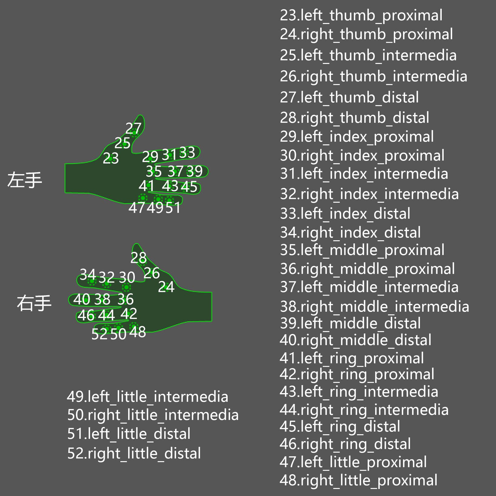
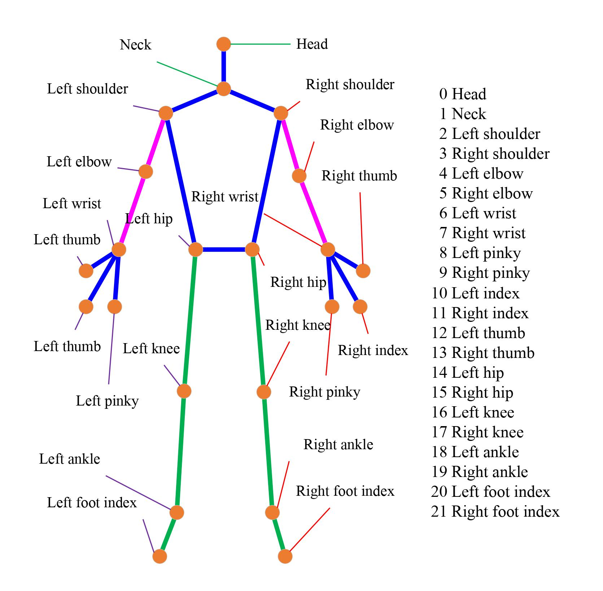

# Motion quality assessment for JDM


## Skeleton topolopy


## Project structure

```shell script
.
├── data
│   ├── raw
│   │   ├── AA.FBX
│   │   └── BB.FBX
│   └── tmp
│       └── JDM_motion.npz
├── README.md
├── test.py
└── utils
    ├── fbx2npy.py
    ├── fbx2npz.py
    └── visualize_frames.py
```


## `FBX` to `NPZ` converter

The original topology is as follows:




By the following script, the data fromat can be coverted from `FBX` to `NPZ`.

```shell script
cd ./utils
blender --background -P fbx2npz.py
```

The obtained topology is as follows:

