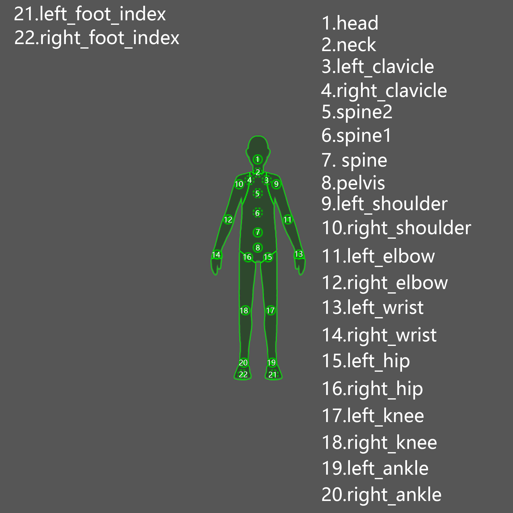
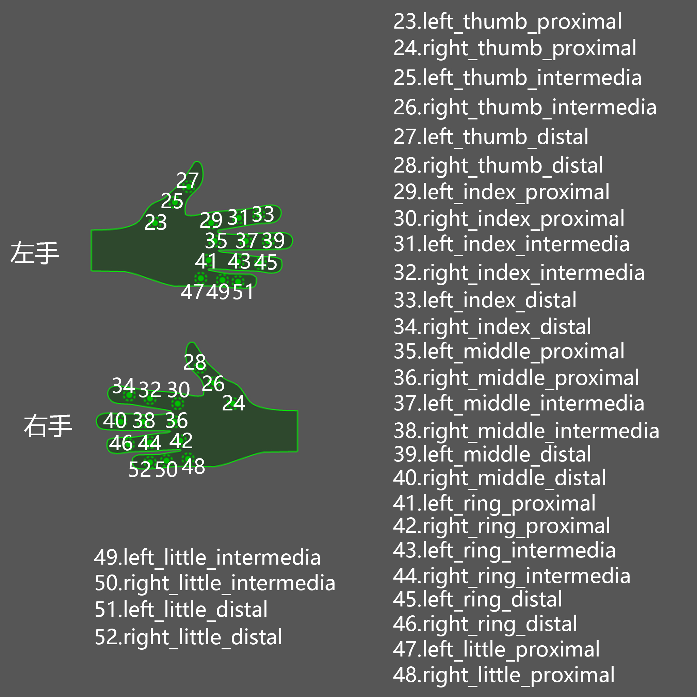
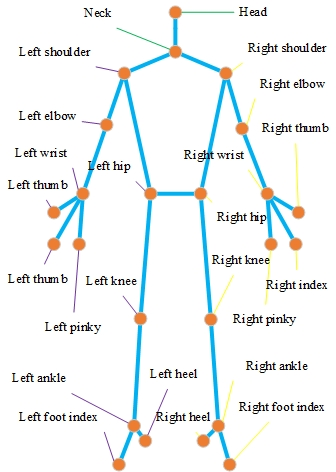

# Motion quality assessment for JDM


## Skeleton topolopy


## `fbx` to `npz` converter

The original topology is as follows:

<center>
    
    
</center>


By the following script, the original data format can be converted from `fbx` to `npz`.

```shell script
cd ./utils
blender --background -P fbx2npz.py
```

The original data is located in `./data/fbx`, while the obtained data is located in `./data/npz`.

The obtained topology is as follows:


